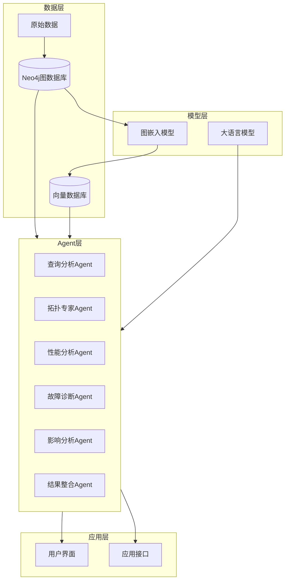
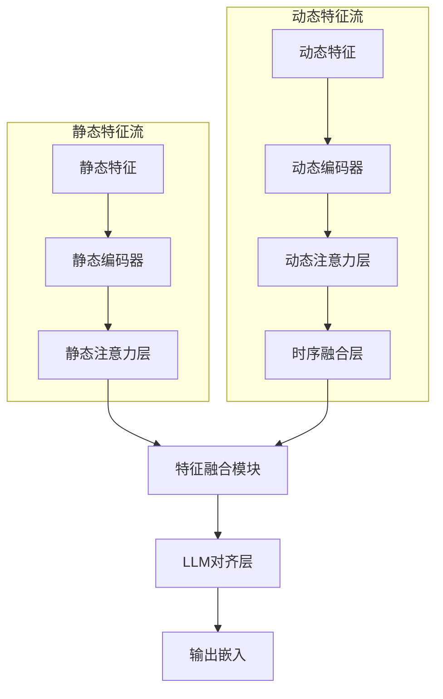
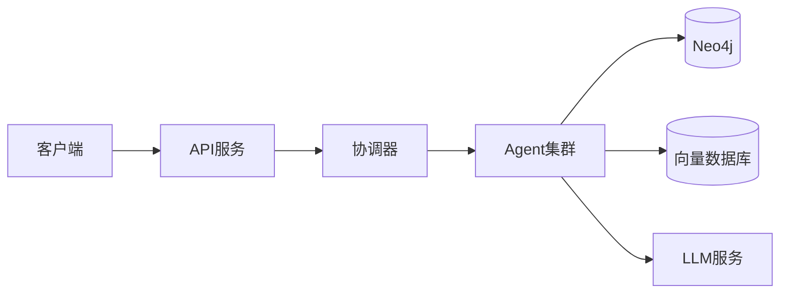

# LLM增强的5G核心网资源图谱系统设计方案

## 1. 系统概述

### 1.1 设计目标
构建一个结合LLM能力的5G核心网资源图谱系统，实现：
- 语义感知的图表示学习
- 高效的资源检索和分析
- 智能的故障诊断和预测
- 自然的人机交互体验

### 1.2 系统架构


## 2. 图嵌入模型设计

### 2.1 双流架构设计


### 2.2 模型组件设计
```python
class DualStreamGraphEncoder(nn.Module):
    def __init__(self, llm_hidden_size=1536):
        super().__init__()
        
        # 静态特征流
        self.static_encoder = StaticStreamEncoder(
            node_dim=256,
            edge_dim=128,
            hidden_dim=512,
            output_dim=llm_hidden_size
        )
        
        # 动态特征流
        self.dynamic_encoder = DynamicStreamEncoder(
            metrics_dim=64,
            logs_dim=32,
            temporal_dim=24,
            hidden_dim=512,
            output_dim=llm_hidden_size
        )
        
        # 特征融合模块
        self.fusion_module = CrossStreamFusion(
            hidden_size=llm_hidden_size,
            num_heads=8
        )
        
        # LLM对齐层
        self.llm_alignment = LLMAlignmentLayer(
            input_dim=llm_hidden_size,
            llm_model='text-embedding-ada-002'
        )

    def forward(self, static_data, dynamic_data):
        # 静态特征编码
        static_embeddings = self.static_encoder(
            static_data.node_features,
            static_data.edge_features,
            static_data.graph_structure
        )
        
        # 动态特征编码
        dynamic_embeddings = self.dynamic_encoder(
            dynamic_data.metrics,
            dynamic_data.logs,
            dynamic_data.timestamps
        )
        
        # 特征融合
        fused_embeddings = self.fusion_module(
            static_embeddings,
            dynamic_embeddings
        )
        
        # LLM对齐
        final_embeddings = self.llm_alignment(fused_embeddings)
        
        return final_embeddings
```

### 2.3 静态特征流
- **节点静态特征编码**：
  - 业务类型编码：使用可学习的嵌入表示不同业务类型
  - 层级编码：位置编码表示网络层级关系
  - 容量特征：数值特征的归一化处理

- **边静态特征编码**：
  - 关系类型编码：不同类型关系的可学习嵌入
  - 拓扑特征：结构化信息的图注意力编码
  - 权重特征：边权重的数值编码

### 2.4 动态特征流
- **性能指标编码**：
  ```python
  class MetricsEncoder(nn.Module):
      def __init__(self, input_dim, hidden_dim):
          self.temporal_conv = TemporalConvNet(
              input_dim=input_dim,
              hidden_dim=hidden_dim,
              kernel_size=3
          )
          self.attention = MultiHeadAttention(
              hidden_dim=hidden_dim,
              num_heads=4
          )
  ```

- **日志状态编码**：
  ```python
  class LogStatusEncoder(nn.Module):
      def __init__(self, num_status, hidden_dim):
          self.status_embedding = nn.Embedding(
              num_embeddings=num_status,
              embedding_dim=hidden_dim
          )
          self.temporal_transformer = TransformerEncoder(
              hidden_dim=hidden_dim,
              num_layers=2
          )
  ```

### 2.5 特征融合与LLM对齐
- **跨流注意力机制**：
  ```python
  class CrossStreamFusion(nn.Module):
      def __init__(self, hidden_size, num_heads):
          self.cross_attention = MultiHeadCrossAttention(
              hidden_size=hidden_size,
              num_heads=num_heads
          )
          self.fusion_ffn = FeedForward(
              hidden_size=hidden_size,
              intermediate_size=hidden_size * 4
          )
  ```

- **LLM语义对齐**：
  - 对比学习损失：最小化图嵌入与LLM文本嵌入的距离
  - 语义一致性损失：保持相似节点的嵌入相似性
  - 结构保持损失：维持图的拓扑结构信息

### 2.6 训练策略
```python
class DualStreamTrainer:
    def __init__(self, model, llm_client):
        self.model = model
        self.llm = llm_client
        self.losses = {
            'contrastive': ContrastiveLoss(),
            'semantic': SemanticConsistencyLoss(),
            'structure': StructurePreservingLoss()
        }
    
    def train_step(self, batch):
        # 获取图数据
        static_data, dynamic_data = batch
        
        # 前向传播
        graph_embeddings = self.model(static_data, dynamic_data)
        
        # 生成文本描述
        text_descriptions = self.generate_descriptions(batch)
        
        # 获取LLM嵌入
        llm_embeddings = self.llm.encode(text_descriptions)
        
        # 计算多任务损失
        losses = {
            'contrastive': self.losses['contrastive'](
                graph_embeddings, llm_embeddings
            ),
            'semantic': self.losses['semantic'](
                graph_embeddings, static_data.similarity_matrix
            ),
            'structure': self.losses['structure'](
                graph_embeddings, static_data.graph_structure
            )
        }
        
        # 总损失
        total_loss = sum(losses.values())
        
        return total_loss, losses
```

### 2.7 推理优化
- **注意力缓存**：缓存静态特征的注意力计算结果
- **增量更新**：仅更新动态特征流的计算结果
- **批处理优化**：支持大规模图数据的批处理推理

## 3. 训练数据集构建

### 3.1 数据收集
```python
class Neo4jDatasetBuilder:
    def __init__(self, neo4j_client, llm_client):
        self.neo4j = neo4j_client
        self.llm = llm_client
        
    def build_training_dataset(self):
        # 提取节点数据
        nodes_data = self._extract_nodes()
        
        # 提取路径数据
        paths_data = self._extract_paths()
        
        # 生成文本描述
        text_descriptions = self._generate_descriptions()
        
        return {
            'nodes': nodes_data,
            'paths': paths_data,
            'descriptions': text_descriptions
        }
```

### 3.2 数据增强
- LLM生成多样化描述
- 构建查询-响应对
- 生成对比学习样本

### 3.3 质量控制
- 数据完整性验证
- 描述质量评估
- 样本平衡性检查

## 4. 双数据库查询系统

### 4.1 系统架构
```python
class DualQuerySystem:
    def __init__(self, neo4j_client, vector_store, llm_client):
        self.neo4j = neo4j_client
        self.vector_store = vector_store
        self.llm = llm_client
        
    def process_query(self, user_query):
        # 查询分析
        query_analysis = self._analyze_query(user_query)
        
        # 并行查询
        results = self._parallel_query(query_analysis)
        
        # 结果合并
        final_response = self._merge_results(results, query_analysis)
        
        return final_response
```

### 4.2 查询流程
1. LLM进行意图识别
2. 分解结构化和语义查询
3. 并行执行查询
4. 合并查询结果

### 4.3 结果优化
- 去重和排序
- 相关性评分
- 结果解释生成

## 5. 多Agent协同系统

### 5.1 Agent设计
```python
class ResourceGraphAgent:
    def __init__(self, neo4j_client, vector_store, llm_client):
        self.agents = {
            'query_analyzer': QueryAnalyzerAgent(llm_client),
            'topology_expert': TopologyExpertAgent(neo4j_client, vector_store),
            'performance_analyst': PerformanceAnalystAgent(neo4j_client, vector_store),
            'fault_diagnoser': FaultDiagnoserAgent(neo4j_client, vector_store),
            'impact_analyzer': ImpactAnalyzerAgent(neo4j_client, vector_store),
            'result_synthesizer': ResultSynthesizerAgent(llm_client)
        }
        
        self.coordinator = AgentCoordinator(self.agents)
```

### 5.2 协作机制
1. 任务分析和规划
2. 并行任务执行
3. 中间结果共享
4. 结果整合和优化

### 5.3 专业化分工
- **查询分析Agent**：理解用户意图
- **拓扑专家Agent**：分析资源结构
- **性能分析Agent**：评估系统性能
- **故障诊断Agent**：诊断问题根因
- **影响分析Agent**：评估影响范围
- **结果整合Agent**：生成综合报告

## 6. 系统集成与部署

### 6.1 部署架构


### 6.2 配置管理
- 环境配置
- 模型参数
- Agent策略
- 查询优化

### 6.3 监控与维护
- 性能监控
- 错误追踪
- 模型更新
- 数据同步

## 7. 使用示例

### 7.1 基础查询
```python
# 初始化系统
system = ResourceGraphAgent(
    neo4j_client=Neo4jClient(),
    vector_store=QdrantClient(),
    llm_client=OpenAIClient()
)

# 处理查询
query = "找出最近24小时内CPU使用率异常的虚机及其影响的网元"
response = system.process_request(query)
```

### 7.2 复杂分析
```python
# 故障诊断请求
request = """
分析VM_001虚机最近24小时内的异常状况：
1. 确定故障发生的时间点
2. 分析故障的根本原因
3. 评估故障影响范围
4. 建议解决方案
"""

response = system.process_request(request)
```

## 8. 后续优化方向

### 8.1 模型优化
- 改进语义对齐策略
- 优化图表示学习
- 增强时序建模能力

### 8.2 系统增强
- 添加新的专业Agent
- 优化协作机制
- 改进缓存策略

### 8.3 功能扩展
- 支持更多查询类型
- 增加可视化功能
- 提供API集成能力 